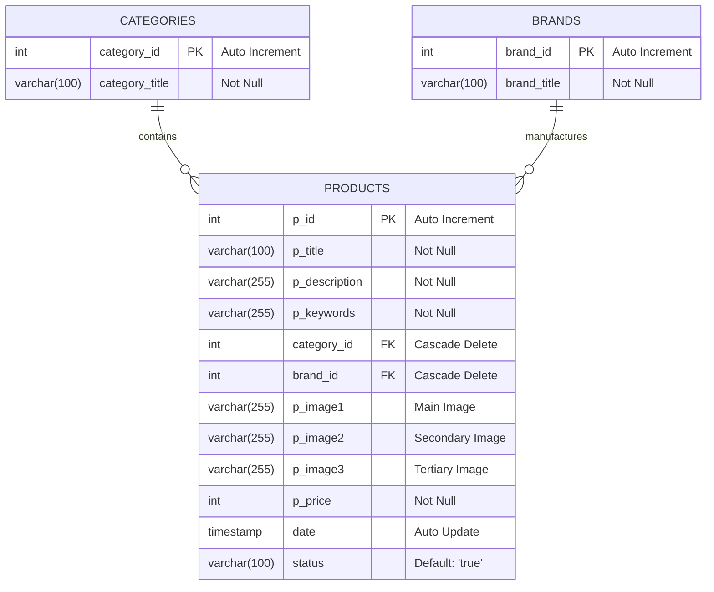

# E-Commerce Database Architecture

This document outlines the database schema for the E-Commerce platform. It includes the structural definitions, relationships, and initial seed data necessary to bootstrap the application.

## Entity-Relationship Diagram



---

## Database Initialization

```sql
CREATE DATABASE IF NOT EXISTS ecommerce_db;
USE ecommerce_db;
```

## Schema Definitions

### 1. Categories Table
Stores the structural hierarchy of product classifications. Must be created before the `products` table.

```sql
CREATE TABLE categories (
    category_id INT(11) NOT NULL AUTO_INCREMENT,
    category_title VARCHAR(100) NOT NULL,
    PRIMARY KEY (category_id)
) ENGINE=InnoDB DEFAULT CHARSET=utf8mb4;
```

### 2. Brands Table
Stores the manufacturers or parent brands of the products. Must be created before the `products` table.

```sql
CREATE TABLE brands (
    brand_id INT(11) NOT NULL AUTO_INCREMENT,
    brand_title VARCHAR(100) NOT NULL,
    PRIMARY KEY (brand_id)
) ENGINE=InnoDB DEFAULT CHARSET=utf8mb4;
```

### 3. Products Table
The core table containing all inventory items. Utilizes foreign key constraints with `ON DELETE CASCADE` to ensure referential integrity; deleting a brand or category will automatically remove all associated products.

```sql
CREATE TABLE products (
    p_id INT(11) NOT NULL AUTO_INCREMENT,
    p_title VARCHAR(100) NOT NULL,
    p_description VARCHAR(255) NOT NULL,
    p_keywords VARCHAR(255) NOT NULL,
    category_id INT(11) NOT NULL,
    brand_id INT(11) NOT NULL,
    p_image1 VARCHAR(255) NOT NULL,
    p_image2 VARCHAR(255) NOT NULL,
    p_image3 VARCHAR(255) NOT NULL,
    p_price INT(11) NOT NULL,
    date TIMESTAMP DEFAULT CURRENT_TIMESTAMP ON UPDATE CURRENT_TIMESTAMP,
    status VARCHAR(100) DEFAULT 'true',
    PRIMARY KEY (p_id),
    
    CONSTRAINT fk_category FOREIGN KEY (category_id) 
        REFERENCES categories(category_id) 
        ON DELETE CASCADE ON UPDATE CASCADE,
    
    CONSTRAINT fk_brand FOREIGN KEY (brand_id) 
        REFERENCES brands(brand_id) 
        ON DELETE CASCADE ON UPDATE CASCADE
) ENGINE=InnoDB DEFAULT CHARSET=utf8mb4;
```

---

## Initial Seed Data

Run these queries to populate the database with sample data for initial testing and development.

### Seed Categories
```sql
INSERT INTO categories (category_title) VALUES 
('Laptops'), 
('Mobiles'), 
('Accessories'), 
('Cameras');
```

### Seed Brands
```sql
INSERT INTO brands (brand_title) VALUES 
('HP'), 
('Apple'), 
('Samsung'), 
('Dell'), 
('Sony');
```

### Seed Products
```sql
INSERT INTO products (p_title, p_description, p_keywords, category_id, brand_id, p_image1, p_image2, p_image3, p_price, status) 
VALUES 
(
    'HP Pavilion Laptop', 
    'High performance laptop for students', 
    'hp, laptop, electronics', 
    1, 
    1, 
    'hp_laptop.jpg', 
    'hp_side.jpg', 
    'hp_back.jpg', 
    750, 
    'true'
);
```