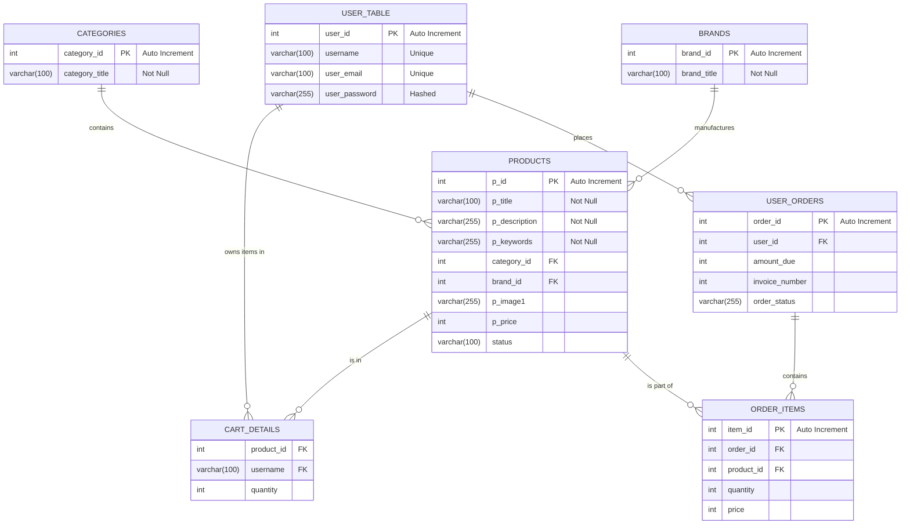

# E-Commerce Database Architecture

This document outlines the database schema for the E-Commerce platform. It includes the structural definitions, relationships, and initial seed data necessary to bootstrap the application.

## Entity-Relationship Diagram



---

## Schema Definitions

### 1. Categories, Brands & Products
Refer to `db.sql` for the core product management tables.

### 2. User Table
Stores registered customer information with hashed passwords.

```sql
CREATE TABLE IF NOT EXISTS user_table (
    user_id INT(11) NOT NULL AUTO_INCREMENT,
    username VARCHAR(100) NOT NULL,
    user_email VARCHAR(100) NOT NULL,
    user_password VARCHAR(255) NOT NULL,
    user_address VARCHAR(255) NOT NULL,
    user_contact VARCHAR(20) NOT NULL,
    user_ip VARCHAR(100) NOT NULL,
    PRIMARY KEY (user_id)
) ENGINE=InnoDB DEFAULT CHARSET=utf8mb4;
```

### 3. Cart Details
A persistence layer for the shopping cart. Uses a composite primary key of `(product_id, username)`.

```sql
CREATE TABLE IF NOT EXISTS cart_details (
  product_id INT(11) NOT NULL,
  username VARCHAR(100) NOT NULL,
  quantity INT(11) NOT NULL,
  PRIMARY KEY (product_id, username)
) ENGINE=InnoDB DEFAULT CHARSET=utf8mb4;
```

### 4. User Orders
Summarizes the final purchase, including total amount and payment status.

```sql
CREATE TABLE IF NOT EXISTS user_orders (
  order_id INT(11) NOT NULL AUTO_INCREMENT,
  user_id INT(11) NOT NULL,
  amount_due INT(11) NOT NULL,
  invoice_number INT(11) NOT NULL,
  total_products INT(11) NOT NULL,
  order_date TIMESTAMP NOT NULL DEFAULT current_timestamp(),
  order_status VARCHAR(255) NOT NULL,
  PRIMARY KEY (order_id)
) ENGINE=InnoDB DEFAULT CHARSET=utf8mb4;
```

### 5. Order Items
Stores a snapshot of each product purchased at the time of order placement.

```sql
CREATE TABLE IF NOT EXISTS order_items (
  item_id INT(11) NOT NULL AUTO_INCREMENT,
  order_id INT(11) NOT NULL,
  product_id INT(11) NOT NULL,
  quantity INT(11) NOT NULL,
  price INT(11) NOT NULL,
  PRIMARY KEY (item_id)
) ENGINE=InnoDB DEFAULT CHARSET=utf8mb4;
```